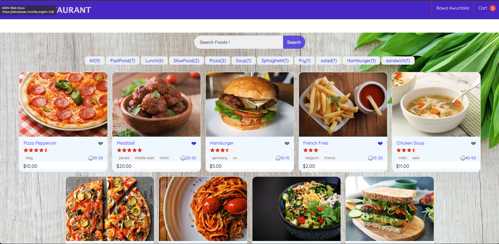
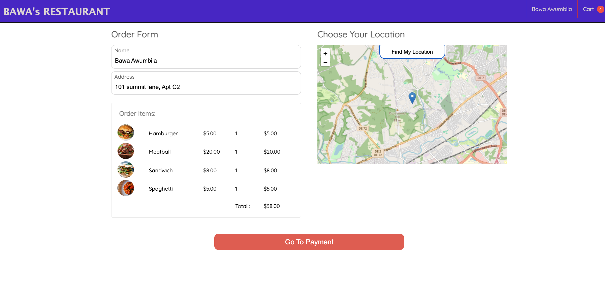
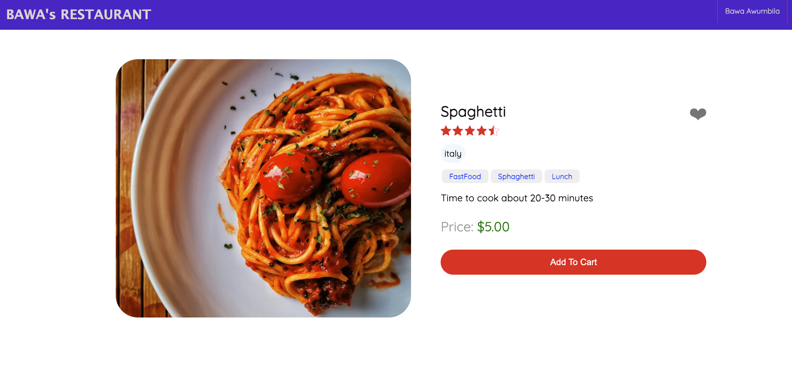

# Bawa,s Food App.

1. A simple Food Ordering APP.
2. Create a login by clicking register here.
3. Homepage allows you Select your favorite food from the menu.
4. dropdown on the header allows you to go to profile to make changes,
   view orders or logout.
5. You can find foods via search bar up top or filter via category.
6. Clicking on food takes you to food page where you can add to the cart.
7. You can add various foods and remove them from the cart page, the total
   cost of the food selected updated in real time on the cart page as well
   as on the badge at the top right of the page.
8. You can proceed to the checkout page which gives you a summary of your order,
9. click find my location (required) and proceed to "Go to payment.
10. Payment page allows for you to make payment via paypal which then brings you to your order summary page.

## Getting Started. 🏎💨

[click here](https://bawafood.onrender.com/) to get started.

## Technologies Used. ⚙️

- CSS
- Express
- MongoDB
- Mongoose
- Morgan
- CORS
- Github
- Paypal API
- Render for deployment.

## Screenshots. 📸

## Future Enhancements. 🛠

- Minor UI tweeks.
- Possible Animations.
- Add Update Feature.
